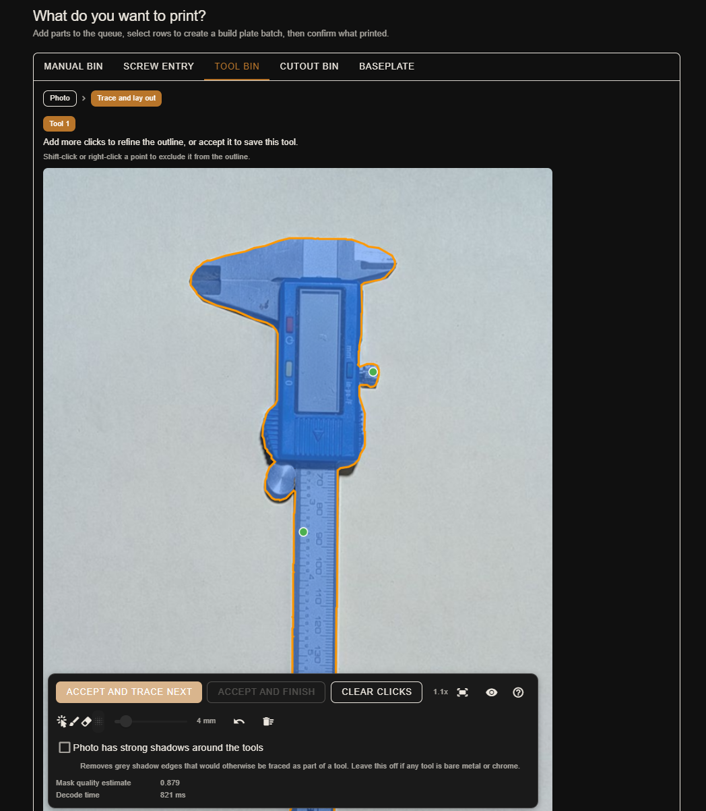
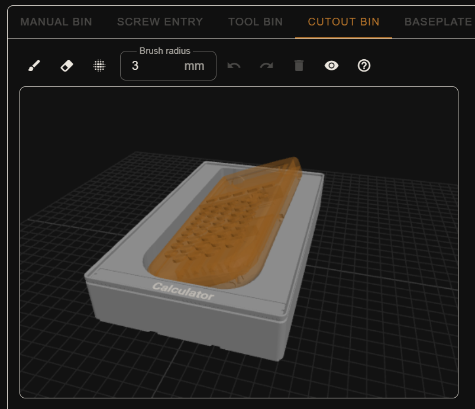
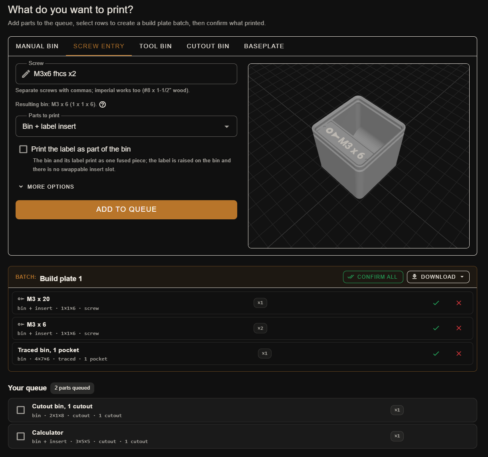

# StoreForge

Any generator makes a bin. StoreForge plans your whole Gridfinity setup in the browser: bins from your screw list, cavities from a tool photo or an STL, labels, baseplates, and one 3MF build plate for Orca Slicer.

[](https://github.com/jaak0b/StoreForge/actions/workflows/ci.yml)
[](LICENSE)



## Try it

**[storeforge.jaak0b.at](https://storeforge.jaak0b.at)** is free and open source, runs entirely in your browser, and uploads nothing. Your plan stays in your browser's local storage.

## Why this exists

Printing a shelf of Gridfinity bins usually means juggling a spreadsheet, a slicer project, and a pile of loose parts whose sizes you are trying to remember. StoreForge keeps the whole plan in one place: add a bin or a baseplate, see it in 3D immediately, size it to the hardware or tool it holds, batch a stack of them onto one build plate, and check off what actually came out of the printer.

Everything runs in your browser. The geometry (bin bodies, stacking lips, baseplates, labels, carved cavities) is built with [manifold-3d](https://github.com/elalish/manifold), a WebAssembly constructive solid geometry engine that guarantees watertight, printable meshes, running in a Web Worker so the page never freezes. Nothing is uploaded anywhere.

## What you get

The add-bin card has five tabs, each producing entries in a single shared queue.

- **Manual bin.** Set the grid size (width x depth x height in Gridfinity units), give it up to two label lines with an optional hardware icon, a quantity, and magnet holes. Divide the interior with free-angle walls placed by drag or by millimetre entry, or generate an evenly spaced grid of walls with one quick entry.
- **Screw entry.** Paste a hardware list like `m3x20 fhcs, m5x12 bhcs` and StoreForge parses it into correctly sized, labeled queue entries, one bin per fastener named on its label.
- **Tool bin.** Photograph a tool or part against a sheet of paper, click to segment it, and StoreForge fits a bin around the traced outline, including a measured interior scoop so a fingertip can reach under the tool.
- **Cutout bin.** Import STL models, place them in the bin, and carve their shape out as a fitted cavity.
- **Baseplate.** Generate baseplates with magnet holes, screw holes, and connectable edges (with printable connection clips to join neighbours). A drawer-fill mode sizes a set of plates wall to wall to fill a drawer, with a brim on the outer edges to take up the remaining millimetres.



Every bin also carries a swappable label insert slot compatible with the label insert system from ["Gridfinity bin with printable label" by Pred](https://www.printables.com/model/592545-gridfinity-bin-with-printable-label-by-pred-parame) on Printables, so inserts and bins interchange with that ecosystem. Print the bin and its label insert as separate pieces to swap labels later, or fuse the label onto the bin as one print.

### Exports and print tracking

- **STL per part**, or a full **3MF build plate** for Orca Slicer, with the label on a second filament slot for toolchanger or AMS printing.
- **Batching.** StoreForge arranges queued entries onto build plates for you before writing the 3MF.
- **Print tracking.** After a print session, check off the bins that came out fine; anything that failed stays queued for the next plate.
- **Plan file.** The plan lives in your browser's local storage; export or import it as JSON to back it up or move it between machines.



Bin geometry uses the published Gridfinity spec: 42 mm pitch, 41.5 mm base footprint, 7 mm height units, and the standard stacking lip.

## Requirements and limitations

- Runs in a modern desktop browser with WebAssembly and WebGL support (Chrome, Firefox, Edge). No server, no account, no install.
- The plan is stored in your browser's local storage; clearing site data clears your queue. Use the JSON export to keep a backup.
- 3MF export targets Orca Slicer's per-part extruder metadata; other slicers may not read the label's assigned filament slot correctly.
- This is a single-user, local-first tool: there is no cloud sync between browsers or devices.

## Development

Requires Node.js. All commands run inside `web/`:

```bash
npm install
npm run dev     # Vite dev server
npm run build   # typecheck + production build
npm test        # Vitest unit tests
```

The stack is Vue 3, TypeScript, Vite, Vuetify, and Pinia. All geometry generation runs in a Web Worker (`web/src/worker/`); the engine modules under `web/src/engine/` are framework-agnostic and take the loaded manifold-3d instance as a parameter, so the WASM stays out of the main bundle and tests can inject it.

Gridfinity bin geometry constants are ported from the MIT-licensed
[kennetek/gridfinity-rebuilt-openscad](https://github.com/kennetek/gridfinity-rebuilt-openscad).

## Contributing

Issues and pull requests are welcome at [github.com/jaak0b/StoreForge](https://github.com/jaak0b/StoreForge).

## License

MIT, see [LICENSE](LICENSE).
